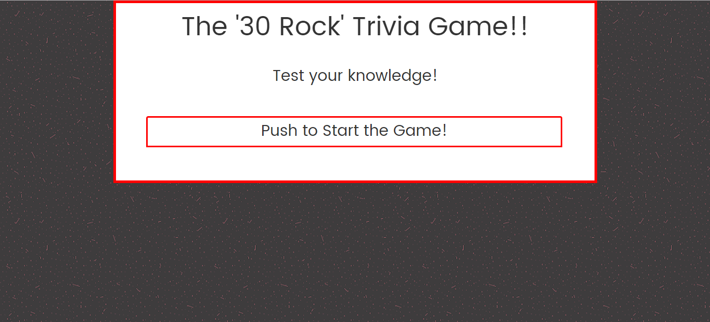
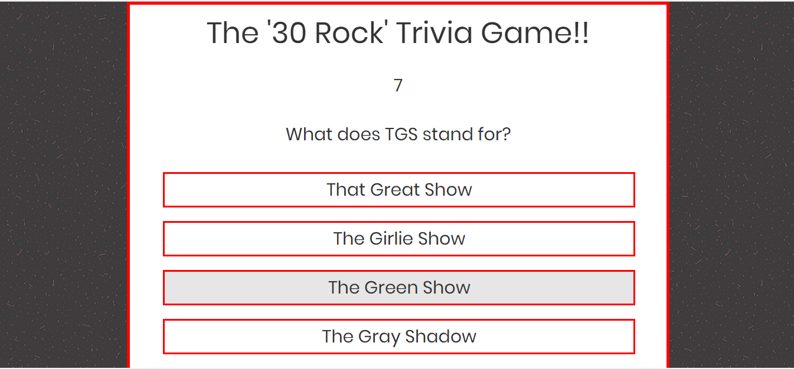
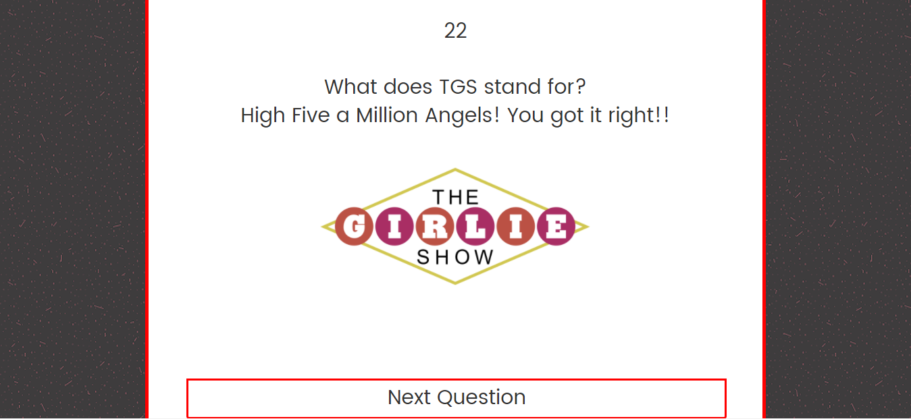
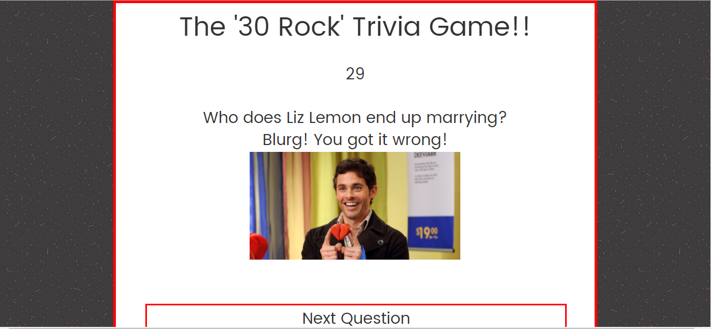
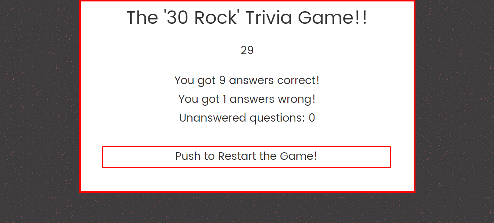

# TriviaGame

This is a 30 Rock Trivia Game!

## How it works

After the user hits the start button they are shown a question. The user has 30 seconds to answer the question before it is automatically submitted. 

If the user answers correctly they are told they have answered correctly.

If their answer is incorrect, they are told that they got the question wrong.

At the end the user is told the number of questions that they got right and wrong.

## Languages and Packages Used

This application uses HTML, CSS, Bootstrap, JavaScript and JQuery.

